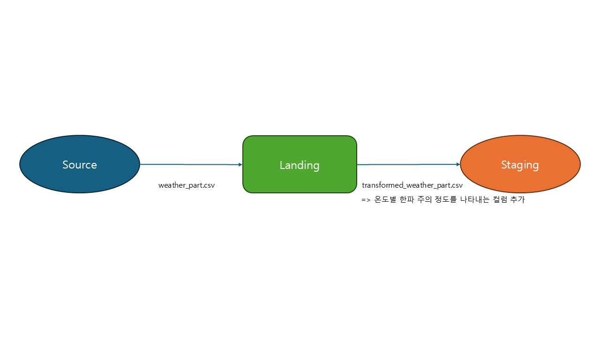

# Week 1. ETL (Extract, Load, Transform)

## 1. 주제
- 날씨 더미데이터를 생성하여 겨울철 체감온도를 구하는 ELT 로직 구현
- 크게 Normal(정상), Coldwave Advisory(한파 주의보), Coldwave Warning(한파 경보)

## 2. 파일 설명
- elt.py 
    - 데이터를 추출, 적재, 변환하는 작업 로직 구현
- main.py
    - main이 되는 python 파일
- source
    - 소스가 될 데이터파일이 위치한 곳 (더미 데이터 csv 파일을 생성하여 사용)
- landing 
    - extract_and_load.py의 결과 데이터를 적재
- staging
    - transform.py의 결과 데이터를 적재


## 3. 프로세스 순서

1) main.py (메인으로 진행되는 함수)
2) elt.py (추출, 적재, 변환 작업을 진행하는 함수)
  - extract() : 더미 데이터 csv를 생성
  - load() : 생성한 csv를 landing 디렉터리에 임시 적재
  - transform() : landing 디렉터리에 담긴 csv를 읽어 변환 작업 진행 후, staging 디렉토리에 최종 적재

## 4. 실행방법

1) PowerShell
```PowerShell
$ python main.py 
```

2) Bash
```Bash
$ python3 main.py
```

## 5. 프로세스 도식화
